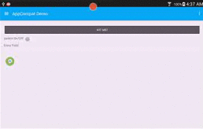

# PSA
**You probably shouldn't upgrade to Xamarin.Android 5.1.4 until they fix the debug issues. Currently, the only way to debug Android apps is to disable all linking.**

Please see all the comments [here](http://forums.xamarin.com/discussion/44632/stable-release-xamarin-android-5-1-4-cycle-5-service-release-2#latest). If you already upgraded to 5.1.4 and are experiencing issues, it's recommended to downgrade to 5.1.3 until the issues are resolved.

# [Power to the people, Cos!](http://www.imdb.com/title/tt0105435/?ref_=nv_sr_1)

Provide Material Design themes now for Xamarin.Forms apps natively without hacks! Check out the [wiki](https://github.com/nativecode-dev/oss-xamarin/wiki) for more information. And yes, I [blogged](https://www.secretlifeof.net/development/use-appcompat-v7-with-xamarin-forms) about it.

**NOTE**: As it is still very early in the project (v1.1 will be considered production ready), expect breaking changes.

[](http://nativecode.no-ip.org:90/viewType.html?buildTypeId=xamarin_master&guest=1)
[](http://nativecode.no-ip.org:90/viewType.html?buildTypeId=xamarin_development&guest=1)

## [AppCompat](https://www.nuget.org/packages/NativeCode.Mobile.AppCompat/) [](https://www.nuget.org/packages/NativeCode.Mobile.AppCompat/)

Simply install the NuGet package into your Android project.

`Install-Package NativeCode.Mobile.AppCompat`

Once installed, you should replace your *FormsApplicationActivity* derived activities with *AppCompatFormsApplicationActivity*.

For instance:

```csharp
public class MainActivity : AppCompatFormsApplicationActivity
{
  protected override void OnCreate(Bundle savedInstanceState)
  {
    base.OnCreate(savedInstanceState);

    Forms.Init(this, savedInstanceState);

    this.LoadApplication(new App());
  }
}
```

You can then use the normal `Forms.Init` and `LoadApplication` methods to initialize your activities. You also no longer need to define your own **styles.xml** as you can use the ones already packaged (the exception is if you want your own colors).

The following styles are available:
- CompatTheme (Theme.AppCompat)
- CompatThemeLight (Theme.AppCompat.Light)
- CompatThemeLightDarkActionBar (Theme.AppCompat.Light.DarkActionBar)

## [AppCompat Controls](https://www.nuget.org/packages/NativeCode.Mobile.AppCompat.Controls/) [](https://www.nuget.org/packages/NativeCode.Mobile.AppCompat.Controls/)

Simply install the NuGet package into your PCL project that contains your UI.
NOTE: You must install the Renderers package into your Android project.

`Install-Package NativeCode.Mobile.AppCompat.Controls`

### Available controls
- (Beta) Card ([CardView](https://developer.android.com/reference/android/support/v7/widget/CardView.html))
- FloatingButton ([FloatingActionButton](https://developer.android.com/reference/android/support/design/widget/FloatingActionButton.html))
- (Beta) NavigationLayout ([NavigationView](https://developer.android.com/reference/android/support/design/widget/NavigationView.html))
- IUserNotifier ([Snackbar](https://developer.android.com/reference/android/support/design/widget/Snackbar.html))

## [AppCompat Renderers](https://www.nuget.org/packages/NativeCode.Mobile.AppCompat.Renderers/) [](https://www.nuget.org/packages/NativeCode.Mobile.AppCompat.Renderers/)

Simply install the NuGet package into your Android project.

`Install-Package NativeCode.Mobile.AppCompat.Renderers`

Once installed, you will have to call `AppCompatRenderers.EnableAll` inside your OnCreate, after `Forms.Init` is called. This will register all of the AppCompat renderers to replace existing Xamarin.Forms renderers.

```csharp
public class MainActivity : AppCompatFormsApplicationActivity
{
  protected override void OnCreate(Bundle savedInstanceState)
  {
    base.OnCreate(savedInstanceState);

    Forms.Init(this, savedInstanceState);
    FormsAppCompat.EnableAll();

    this.LoadApplication(new App());
  }
}
```

### Current Renderers
- Button ([AppCompatButton](http://developer.android.com/reference/android/support/v7/widget/AppCompatButton.html))
- Entry ([AppCompatEditText](http://developer.android.com/reference/android/support/v7/widget/AppCompatEditText.html))
- Picker ([AppCompatSpinner](https://developer.android.com/reference/android/support/v7/widget/AppCompatSpinner.html))
- Switch ([SwitchCompat](http://developer.android.com/reference/android/support/v7/widget/SwitchCompat.html))
- MasterDetailPage (AppCompatMasterDetailRenderer)

## Devices Tested

### Phones
- Nexus 5 (emulator)
- Samsung Galaxy S6


### Tablets
- Samsung Tab 7
- Nexus 7



### LICENSE
```
   Copyright 2015 NativeCode Development

   Licensed under the Apache License, Version 2.0 (the "License");
   you may not use this file except in compliance with the License.
   You may obtain a copy of the License at

       http://www.apache.org/licenses/LICENSE-2.0

   Unless required by applicable law or agreed to in writing, software
   distributed under the License is distributed on an "AS IS" BASIS,
   WITHOUT WARRANTIES OR CONDITIONS OF ANY KIND, either express or implied.
   See the License for the specific language governing permissions and
   limitations under the License.
 ```
